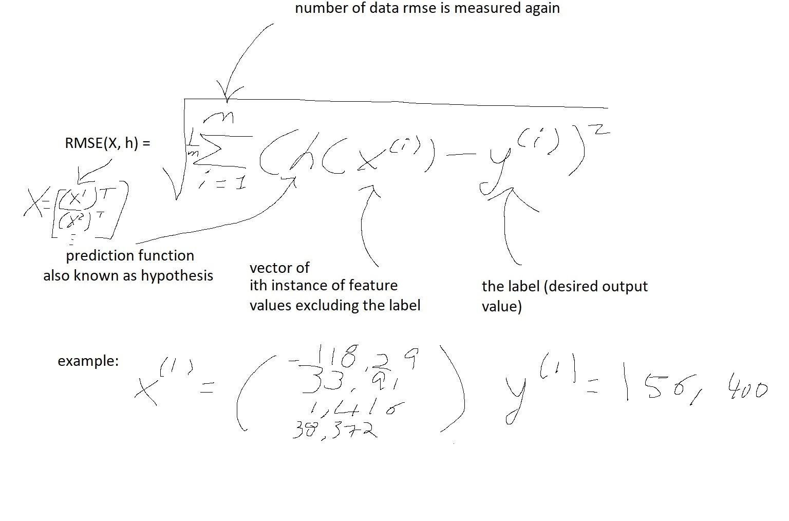

# This project provides a detailed flow of ml problem solving steps.
* These are my notes combined with california sensus example from Hands-On Machine Learning with Scikit-Learn, Keras & TensorFlow book 2nd edition.
* The notes and source code are written by me while going through the book's tutorials. 
* The dataset is provided via the book's tutorials.

## 0. Pre-req
* Install visual studio code. Install python extension
* Install anaconda
* Open anaconda cmd to install all the required modules.
  * conda install python=3.6
  * conda install -c conda-forge jupyterlab
  * conda install numpy
  * conda install pandas
  * conda install -c conda-forge matplotlib
  * conda install -c intel scikit-learn
* on vscode, ctrl+shift+p to open command pallet and run create new jupyter...

## 1. Dataset
population, median income, median housing price for each block group in California.

## 2. Model goal
predict housing price in any district

## 3. Framing the problem

### 3.1 Identifying business objective.
* Output of the model will go through another ml system with other values to determine if investiment in a given area is worth it

### 3.2 Identify current situation
* Users are manually estimating, and this is expensive.

### 3.3 Choose ml type
1. Supervised, unsupervised, or reinforcement learning? 
    * supervised since we are labeling training examples
2. Classification task, regression task, or something else? 
    * regression since we are predicting a value. univariate regression because we predict a single value. if we were predicting multiple values per district it would be multivariate regression.
3. Batch learning, or online learning? 
    * Batch will be chosen because there won't be a continuous flow of data. No need for rapid adjustment.

### 3.4 Selecting a performance measure
* we choose Root Mean Square Error to give an idea of how much error the system typically makes in its prediction with higher weit on large errors.

* There are others for regression tasks such as Mean Absolute Error (MAE). Both are ways to measure the distance between two vectors (vector of predictions, and vector of target).
* root of sum of squares (RMS) => Euclidean norm => l2 norm (the two here is the square) => notion of distance we are familiar with
* mean absolute error => Manhattan norm => l1 norm (there are no square) => measures distance between 2 points in a city of you only travel along orthogonal city blocks.

* the norm index k is the square, cube, etc... in the (h(xi)-y(i))^k part of the equation.
* the higher the norm index, the more it focuses on large values and neglects small ones. This is why RMSE is more sensitive to outliers than MAE. 
* When outliers are rare, RMSE works very well.

### 3.5 Check the assumptions
Check with people if the assumptions are correct. For example, is the business objective correct? do we care really care about pricing for this model pipeline or should we care about another output because that's the input to another ml pipeline.

### 4. Getting start
* See Housing.jpynb for code example and steps
* Make sure label values are not capped. ML may learn the value never go beyond that limit. (readjust the values, or remove them from the training and test dataset)
* Take notice of attributes not in unit of choice. it's ok but make sure we understand how its computed.
* Take notice of different scales, we'll need to explore scaling feature later.
* Take notice of histograms that are tail-heavy. ML doesn't work well with it for detecting patterns. We'll try to transform it into bell curves later.

#### 4.1 Create a test set
* Set aside some data (20%) randomly to be used as test set (NEVER LOOK AT IT). The human brain is good at pattern detection, thus highly prone to overfitting. If we look at the test set, we may latch onto some patterns in the test set that cause us to choose specific type of ML models solutions.
* The training set and test set is created in jupyter notebook. The same can be achieved by using Sci-Kit library in 5.2 for creating single run train test split.
  
#### 4.2 Repeatable train_test split data
* One thing to note is, THIS ONLY WORKS WELL IF RAN ONCE. If this gets ran again, the test set will change. We don't want to generate a new testset after every run where over time the ML algorithm will see the entire dataset because the test set will be mixed into the new training set, or previous training set we already saw is now in new test set.
* Some options that won't work: (Storing it for later won't work because if we update the dataset, it won't have any new values. If we pre-seed the randomizer, a update to the dataset will still generate random values where training set may include data from previous test set)
* Common solution to ensure test set is consistent and new instances added to the test set never include values part of previous training set: Computer a hash of each instance's idenfier and put that instance in the test set if the has is lower than or equal to 20^ of the max hash value. => test set will remain consistent across multiple runs. Even after refreshing the dataset, the new test set will contain 20% of the new instances, but not any instances previously used in training set. (Example id = 45554, 45554 % 6 = value 2). see hash method in jupyter notebook.

#### 4.3 Create run once train_test split with Sci-Kit library.
* If we only want to create the split once, we can use Sci-Kit's sklearn.model_selection import train_test_split
* These are purely ranom sampling, which works fine if the dataset is large relative to number of attributes. 
* If not, these are risks for sampling bias. Stratified sampling should be used, such that the right number of instances are sampled from each stratum to ensure the test set is representative of everything. 
* Look at medium income for example. You want the dataset to be representative of the various categories. Since medium income is a continuous numerical value, first create a income category attribute.
* Looking at medium income histogram, most income are cluistered around 1.5 to 6. Some go far beyond 6. We need to ensure enough instances in each stratum. Otherwise, the estimate of a stratum's importance is biased.

## Glossary
### Pipelines
* Sequence of data processing componments.
* Components typically run asynchronously.
* Each components pulls in a large amount of data, process it, and store result in data store.
* Another component will later pull this data, process it, and store result in data store.